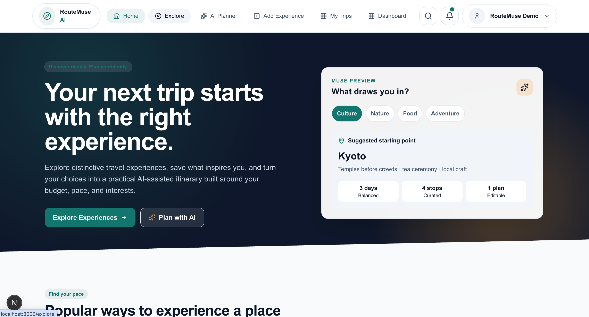
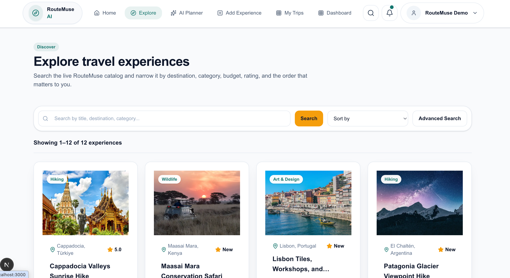
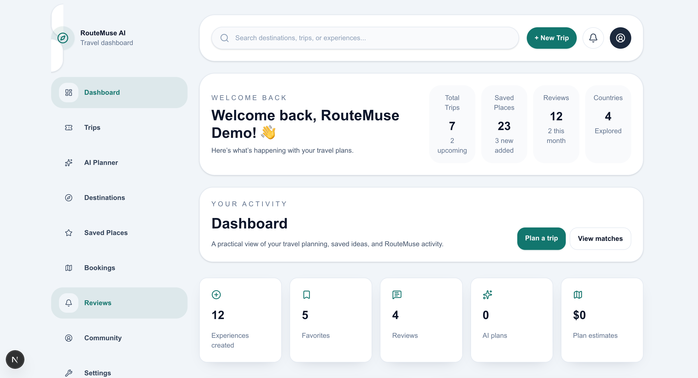

# ✈️ RouteMuse AI



<p align="center">
  <strong>Discover experiences. Plan smarter. Travel your way.</strong>
</p>

<p align="center">
  RouteMuse AI is a full-stack AI-powered travel discovery and trip planning platform that helps travelers discover curated experiences, create personalized itineraries, and manage their travel plans in one place.
</p>

<p align="center">
  <a href="https://routemuse-client.vercel.app">Live Demo</a>
  •
  <a href="https://github.com/nurhossain-webd/routemuse-client.git">Frontend</a>
  •
  <a href="https://github.com/nurhossain-webd/routemuse-server.git">Backend</a>
</p>

---

## 🌍 About RouteMuse AI

**RouteMuse AI** is a modern full-stack travel discovery and planning platform designed to make trip planning easier and more personalized.

Travelers can explore curated experiences, search and filter destinations, view detailed travel listings, save favorites, publish their own experiences, and manage their travel content.

The platform also integrates **Groq-powered Agentic AI** to generate personalized travel itineraries based on user preferences. Users can refine their plans conversationally, continue previous AI conversations, and revisit saved travel plans.

RouteMuse AI combines a modern **Next.js frontend** with a separate **Express.js and MongoDB backend**, providing a scalable architecture for authentication, travel data management, AI integration, recommendations, analytics, and secure REST API communication.

---

## ✨ Key Features

### 🤖 AI Trip Planner

- Generate personalized travel itineraries using AI
- Create plans based on destination and traveler preferences
- Receive structured travel recommendations
- Refine generated itineraries through follow-up conversations
- Maintain conversation context
- Save generated travel plans
- Revisit previous plans and AI conversations
- Powered by **Groq**

### 🧭 Travel Discovery

- Browse curated travel experiences
- Search for experiences
- Filter listings using multiple criteria
- Sort travel experiences
- View detailed travel information
- Explore media and travel-related content
- Discover related experiences

### 💡 Smart Recommendations

- Personalized travel recommendations
- Recommendations based on user interests and activity
- User feedback for recommendation refinement
- Context-aware suggestions

### ❤️ Favorites

- Save interesting travel experiences
- Access saved experiences later
- Manage personal favorites
- Quickly revisit preferred destinations and activities

### 📝 Travel Listings

Authenticated users can:

- Publish new travel experiences
- Manage their own listings
- View published experiences
- Delete listings
- Maintain travel-related content from their dashboard

### 🔐 Authentication & Authorization

- Email and password authentication
- Google sign-in
- JWT-based authentication
- Protected routes
- Secure backend authorization
- Authentication validation and error handling

### 📊 User Dashboard

- Personalized dashboard
- Travel activity overview
- Listing management
- Saved plans
- AI conversation history
- Favorites
- Dashboard analytics

### 📬 Contact & Support

- Functional contact form
- User-friendly support experience
- Proper backend validation and request handling

---

## 🧠 How the AI Trip Planner Works

```text
Traveler Preferences
        │
        ▼
Destination + Travel Details
        │
        ▼
Input Validation
        │
        ▼
Context & Prompt Construction
        │
        ▼
     Groq LLM
        │
        ▼
AI Reasoning & Trip Generation
        │
        ▼
Personalized Itinerary
        │
        ▼
Conversational Refinement
        │
        ▼
Save Plan & Conversation History
```

Unlike a simple text generator, the AI planner uses travel context and previous interactions to help users create and refine personalized travel plans.

---

## 🛠️ Technology Stack

### Frontend

| Technology     | Purpose                         |
| -------------- | ------------------------------- |
| Next.js 16     | Frontend framework              |
| React 19       | User interface                  |
| TypeScript     | Type-safe development           |
| Tailwind CSS   | Responsive styling              |
| TanStack Query | Server-state and API management |

### Backend

| Technology   | Purpose                          |
| ------------ | -------------------------------- |
| Node.js      | JavaScript runtime               |
| Express.js 5 | REST API framework               |
| TypeScript   | Backend type safety              |
| MongoDB      | Application database             |
| JWT          | Authentication and authorization |

### Artificial Intelligence

| Technology           | Purpose                         |
| -------------------- | ------------------------------- |
| Groq                 | LLM-powered AI features         |
| Prompt Engineering   | Structured AI instructions      |
| Conversation Context | Follow-up reasoning             |
| AI Recommendations   | Personalized travel suggestions |

### Development & Quality

| Tool                  | Purpose                 |
| --------------------- | ----------------------- |
| ESLint                | Code quality            |
| TypeScript Checks     | Static type checking    |
| Integration Tests     | API and feature testing |
| Seed Scripts          | Demo data generation    |
| Environment Variables | Secure configuration    |

---

## 🏗️ Project Architecture

RouteMuse AI follows a separated frontend and backend architecture:

```text
RouteMuse-AI/
│
├── routemuse-client/
│   │
│   ├── app/
│   ├── components/
│   ├── hooks/
│   ├── lib/
│   ├── services/
│   ├── types/
│   ├── public/
│   └── package.json
│
├── routemuse-server/
│   │
│   ├── src/
│   │   ├── modules/
│   │   ├── middleware/
│   │   ├── routes/
│   │   ├── services/
│   │   └── ...
│   │
│   └── package.json
│
└── README.md
```

The **frontend** handles the user interface, navigation, authentication experience, API consumption, AI interactions, and responsive design.

The **backend** handles business logic, database operations, authentication, authorization, validation, AI integration, rate limiting, recommendations, and API endpoints.

---

## 🔌 REST API

The backend exposes RESTful endpoints under:

```text
/api/v1
```

The API handles functionality including:

- Authentication
- User management
- Travel listings
- Favorites
- Reviews
- AI trip planning
- AI conversation history
- Saved travel plans
- Recommendations
- User feedback
- Dashboard data
- Contact requests

---

## 📱 Responsive Design

RouteMuse AI is designed to provide a consistent experience across:

- 📱 Mobile
- 📟 Tablet
- 💻 Laptop
- 🖥️ Desktop

The interface uses consistent spacing, typography, card layouts, responsive navigation, and reusable UI components.

---

## 🚀 Getting Started

### Prerequisites

Make sure you have installed:

- Node.js
- npm
- MongoDB or MongoDB Atlas
- Git

You will also need credentials for services used by the application, including Groq and Google authentication.

---

## 📥 Clone the Repository

```bash
git clone YOUR_GITHUB_REPOSITORY_URL
```

Move into the project:

```bash
cd RouteMuse-AI
```

---

## 💻 Frontend Setup

Move into the frontend directory:

```bash
cd routemuse-client
```

Install dependencies:

```bash
npm install
```

Create the required environment file:

```text
.env.local
```

Add the frontend environment variables required by your application.

Then start the development server:

```bash
npm run dev
```

The frontend will normally be available at:

```text
http://localhost:3000
```

---

## ⚙️ Backend Setup

Open another terminal and move into the backend directory:

```bash
cd routemuse-server
```

Install dependencies:

```bash
npm install
```

Create:

```text
.env
```

Add the required backend environment variables.

Then start the backend:

```bash
npm run dev
```

---

## 🔑 Environment Variables

The exact environment variables depend on your configuration.

A typical backend configuration may include:

```env
PORT=5000

DATABASE_URL=YOUR_MONGODB_CONNECTION_STRING

JWT_SECRET=YOUR_JWT_SECRET

GROQ_API_KEY=YOUR_GROQ_API_KEY
```

Your frontend may require variables such as:

```env
NEXT_PUBLIC_API_URL=YOUR_BACKEND_API_URL
```

Add any Google authentication variables required by your authentication implementation.

> **Important:** Never commit `.env`, `.env.local`, API keys, database credentials, JWT secrets, or other sensitive information to GitHub.

---

## 🌱 Demo Data

RouteMuse AI includes seeded demo data to make development, testing, and project demonstration easier.

Run the appropriate seed script from the backend according to the scripts configured in `package.json`.

This can populate the application with demonstration travel experiences and other required data.

---

## 🧪 Testing & Code Quality

The project includes development tooling for maintaining code quality and reliability.

### TypeScript

TypeScript is used throughout both the frontend and backend to improve type safety and maintainability.

### ESLint

Run linting using:

```bash
npm run lint
```

### Integration Testing

The backend includes integration tests for verifying important API and application functionality.

Check the backend `package.json` for the available testing commands.

---

## 🔒 Security

RouteMuse AI follows several important security practices:

- JWT-based authentication
- Protected API endpoints
- Authorization middleware
- Environment-based secret management
- Backend input validation
- API rate limiting
- Secure database access
- Protected user resources
- Server-side AI API integration

Sensitive credentials and AI API keys are kept on the server and are not exposed directly to users.

---

## 🎯 Project Highlights

RouteMuse AI demonstrates:

- ✅ Full-stack application development
- ✅ Next.js 16 and React 19
- ✅ TypeScript frontend and backend
- ✅ Express.js REST API
- ✅ MongoDB database integration
- ✅ Email authentication
- ✅ Google authentication
- ✅ JWT authorization
- ✅ Protected routes
- ✅ Search and filtering
- ✅ Sorting
- ✅ Travel listing management
- ✅ Favorites
- ✅ Reviews
- ✅ AI trip generation
- ✅ Conversational itinerary refinement
- ✅ AI conversation memory
- ✅ Personalized recommendations
- ✅ Recommendation feedback
- ✅ Saved AI travel plans
- ✅ Dashboard analytics
- ✅ Rate limiting
- ✅ Responsive UI
- ✅ Seeded demonstration data
- ✅ Integration testing

---

## 📸 Application Preview

## 📸 Application Preview

## 📸 Application Preview

<table>
  <tr>
    <td width="50%">
      
    </td>
    <td width="50%">
      
    </td>
  </tr>
</table>

<p align="center">
  <em>Explore travel experiences and manage personalized journeys with RouteMuse AI.</em>
</p>
<p align="center">
  <em>Travel discovery and AI-powered personalized trip planning with RouteMuse AI.</em>
</p>

---

## 🌟 Why RouteMuse AI?

Traditional travel platforms often separate travel discovery from trip planning.

RouteMuse AI brings both experiences together.

Users can discover travel experiences, save places they like, receive personalized recommendations, and turn their preferences into AI-generated itineraries without leaving the platform.

The combination of structured travel data and conversational AI makes RouteMuse AI more than a listing platform—it acts as an intelligent travel planning companion.

---

## 🔮 Future Improvements

Potential future improvements include:

- Real-time flight and hotel information
- Interactive maps
- Weather-aware itinerary generation
- Collaborative trip planning
- Budget optimization
- Multi-destination AI planning
- Advanced AI memory
- Real-time travel notifications
- More personalized recommendation models

---

## 👨‍💻 Author

Developed as part of **SCIC-13 Assignment 5 — Project-2: Agentic AI**.

Built with a focus on modern full-stack development, scalable architecture, responsive UI/UX, and practical Agentic AI integration.

---

<p align="center">
  Made with ❤️ for smarter travel.
</p>

<p align="center">
  ⭐ If you like RouteMuse AI, consider giving the repository a star
</p>
